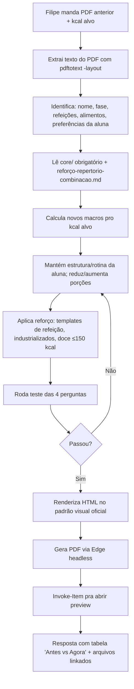

# Workflow — Ajuste de Dieta Pós-Reavaliação (LEAN)

> **Quando usar:** o Filipe (ou o Breno) manda a **dieta anterior em PDF** + **novo objetivo calórico** e pede pra eu atualizar. Sem anamnese nova, sem reavaliação postural formal — só dieta nova entregue.
>
> **Quando NÃO usar:** dieta inicial de aluna nova (usar `fluxo-dieta-mensal.md`) ou reavaliação postural completa (usar `fluxo-reavaliacao.md`).

---

## Inputs obrigatórios

1. **PDF da dieta anterior** (anexado via `@C:\Users\...\Dieta - Nome.pdf`).
2. **Novo objetivo calórico** (ex.: "1.500 kcal max", "manter 1.700 kcal", "subir pra 1.800"). **Se o Filipe não especificar → default 1.450–1.550 kcal** (faixa padrão de recálculo, confirmado 2026-05-25).
3. **(Opcional)** Informação nova sobre treino, restrição que apareceu, preferência atualizada.

Se faltar (1) → **PERGUNTA antes**, não chuta. Se faltar (2) → aplica a faixa default 1.450–1.550 sem pedir confirmação.

---

## Outputs obrigatórios

1. `dieta-<primeiro-nome>-<sobrenome>.html` na raiz do projeto.
2. `dieta-<primeiro-nome>-<sobrenome>.pdf` (gerado via Edge headless).
3. PDF aberto no preview (`Invoke-Item`) ao final.
4. Resposta no chat com **tabela do que mudou** vs a versão anterior.

---

## Fluxo passo a passo



---

## Passos em detalhe

### 1. Ingestão
- PDF anexado via `@<caminho>`.
- Se PDF > 1MB ou > 5 páginas, o Read direto pode falhar — usar **`pdftotext -layout`** via Bash:
  ```bash
  pdftotext -layout "C:\Users\T-GAMER\Downloads\Dieta - Nome.pdf" - | head -400
  ```

### 2. Parse
Extrair do PDF:
- **Nome completo** da aluna
- **Fase** (cutting/manutenção/superávit)
- **Estrutura de refeições** (quantas, em que ordem)
- **Alimentos por refeição** com quantidades
- **Preferências implícitas** (rotina dela — ex.: "cuscuz com ovos", "marmita", "lanche pro trabalho")
- **Restrições/aversões** que o texto deixa claro (ex.: "não gosto de doce", "sem whey")

### 3. Leitura obrigatória (já está no CLAUDE.md)
Ordem:
1. `agents/dieta-mensal.md`
2. `core/metodologia.md`
3. `core/fases-composicao.md`
4. `core/dieta-principios.md`
5. `core/formato-dieta.md`
6. `core/regras-veto-alimento.md`
7. `core/repertorio-receitas.md`
8. **`core/reforco-repertorio-combinacao.md`** ← sempre
9. `templates/dieta-mensal.md`
10. `checklists/dieta.md`

### 4. Recalibração de macros
Com novo kcal alvo:
- **Proteína:** 1.8–2.2 g/kg de peso (se não souber peso, usar ~110–130g/dia em cutting feminino)
- **Gordura:** 20–25% VCT (~35–45g/dia em dietas 1.400–1.700 kcal)
- **Carbo:** o que sobra do VCT
- **Validar:** `prot*4 + carb*4 + gord*9 ≈ VCT alvo` (margem ±50 kcal)

### 5. Distribuição por refeição
Manter o mesmo número de refeições da dieta anterior, **a menos que** o usuário peça mudança explícita. Distribuição padrão:
- **5 refeições:** Café 22% / Lanche manhã 6% / Almoço 31% / Lanche tarde 15% / Jantar 26%
- **4 refeições:** Café 22% / Almoço 33% / Lanche tarde 18% / Jantar 27%
- Almoço sempre é a maior refeição (= 100% da barra visual).

### 6. Preservar preferências da aluna
Regra de ouro: **não invento, não tiro o que ela come**. Se a dieta anterior tem cuscuz com 3 ovos no café — mantém. Se ela já tem rotina de marmita pro almoço — mantém. Apenas ajusta **quantidades** pra bater a nova meta calórica.

Só mexer no repertório se:
- O usuário pediu explicitamente.
- O alimento viola uma regra do `core/` (ex.: castanha em almoço, salada-fit-frango).
- A aluna sinalizou aversão (ex.: "não gosta de doce" → tira doce mesmo que regra mande).

### 7. Aplicar reforço
- Lanche da tarde: pão + proteína + (fruta ou acompanhamento) — templates A/B/C
- Ceia/jantar: hambúrguer caseiro, pizza de Rap 10, panqueca de banana — templates A/B/C/D
- Almoço: arroz < feijão, doce ≤150 kcal nas 3 opções (a menos que aluna não goste — substitui por fruta)
- Café: pão+ovo+queijo, vitamina, sanduíche natural — rotacionar

### 8. Teste das 4 perguntas (HARD GATE)
Antes de renderizar:
1. A aluna tem **vontade** de comer esse prato? _(se não → refaz)_
2. Tem **volume** suficiente pra saciar? _(se não → sobe vegetal/feijão/fruta)_
3. **80–100% dos alimentos estão na rotina dela?** _(se tem ingrediente fit/estranho → tira)_
4. **Sem combinação proibida?** _(banana+amêndoa+ovo / proteína seca sem molho / salada-frango-batata-doce 3× no dia / castanha em almoço)_

Se algum falhou → volta pro passo 6.

### 9. Renderização (padrão visual oficial)
- Base HTML: `modelo-dieta-novo-padrao.html` (toda dieta nesse layout)
- Substituir: título, 5 cards (objetivo / proteína / refeições / medicação / treino), box macros, tabela kcal/refeição com mini-barras, alert box, refeições com opções.
- Salvar como `dieta-<nome>-<sobrenome>.html` na raiz do projeto.

### 10. Gerar PDF
```bash
"/c/Program Files (x86)/Microsoft/Edge/Application/msedge.exe" \
  --headless --disable-gpu --no-pdf-header-footer \
  "--print-to-pdf=C:\Users\T-GAMER\Downloads\squad-breno-fitness\squad-breno-fitness\dieta-<nome>.pdf" \
  "file:///C:/Users/T-GAMER/Downloads/squad-breno-fitness/squad-breno-fitness/dieta-<nome>.html"
```

### 11. Abrir preview
```powershell
Invoke-Item "C:\Users\T-GAMER\Downloads\squad-breno-fitness\squad-breno-fitness\dieta-<nome>.pdf"
```

### 12. Resposta no chat
Devolver:
- **Tabela "Antes vs Agora"** mostrando o que mudou (kcal alvo, proteína, distribuição, quantidades-chave).
- Lista das **opções por refeição** (resumo).
- **Justificativa rápida** de cada mudança ligada à anamnese / pedido do Filipe.
- Links pros arquivos: HTML + PDF.

---

## Atalhos rápidos (cheatsheet de quantidades em cutting feminino)

> **Faixa default de recálculo: 1.450–1.550 kcal.** Coluna do meio (em destaque) é a referência padrão.

| Item | 1.400 kcal | **1.450–1.550 kcal (DEFAULT)** | 1.700 kcal |
|---|---|---|---|
| Arroz almoço | 60g | **80g** | 100g |
| Feijão almoço | 80g | **100g** | 100g |
| Proteína animal | 80g | **90g** | 90g (teto do método) |
| Pão francês café | 50g | **50g** | 50g |
| Ovos café | 1–2 | **2–3** | 3 |
| Cuscuz seco café | 20g | **25–30g** | 35g |
| Whey scoop | 15g (~1/2) | **15–20g** | 20–25g |
| Iogurte natural | 100–170g | **170g** | 170g |
| Azeite almoço | 5g | **5–10g** | 10g |
| Macarrão cozido | 80g | **100g** | 120g |

**Macros default (faixa 1.450–1.550 kcal):**
- Proteína: **110–120g/dia** (29–31% VCT)
- Carbo: **165–180g/dia** (45–48% VCT)
- Gordura: **38–42g/dia** (22–24% VCT)

> Quando reduzir kcal: **primeiro mexer no carbo** (arroz, pão, macarrão, batata), **depois na gordura** (azeite, queijo). Proteína é a última a cair (sempre proteger massa magra).
> Quando subir kcal: inverso — **primeiro carbo peri-treino**, depois gordura insaturada.

---

## Histórico recente desse fluxo (referência)

| Data | Aluna | Trigger | kcal antes → depois |
|---|---|---|---|
| 2026-05-21 | Marcela Brenha | Ajuste sobre dieta existente | 1.500 (mantido) |
| 2026-05-22 | Cíntia Maria Soares | Ajuste sobre PDF anterior | 1.700 → 1.500 |
| 2026-05-25 | Eduarda Gomes | Refeitura completa do PDF antigo | — → 1.500 |
| 2026-05-25 | Carolina Boone Uliana | Anamnese + calibração | 1.700 → 1.500 |

---

## Casos especiais

### Aluna não gosta de doce
→ Substituir doce ≤150 kcal por **fruta** em todas as opções do almoço/jantar. Manter liberação opcional ("se algum dia quiser, libera 1 doce").

### Aluna não gosta / não tem whey
→ Substituir por iogurte natural + frango desfiado / cuscuz com carne / ovos / queijo. Manter ≥1 opção com whey só pra ter alternativa.

### Aluna tem resistência a ovo
→ Garantir ≥2 opções por refeição **sem ovo** (vitamina, sanduíche natural, panqueca pode ficar com 1 ovo só).

### Aluna treina à noite / pós-treino tardio
→ Op.3 do jantar geralmente é "comida rápida pós-treino" (ovo + farofa, macarrão simples) — manter na rotina dela.

### Aluna em Mounjaro/Ozempic/GLP-1
→ **NÃO usar este workflow.** Vai pra `agents/dieta-mounjaro-glp1.md` que tem protocolo próprio (kcal calibrado, proteína ~90g/refeição, creatina obrigatória, psyllium).

---

## Não-negociáveis (lembretes finais)

- **Mais feijão que arroz** sempre.
- **Proteína animal ≤ 90g/refeição.**
- **Arroz branco default** (nunca "integral" escrito).
- **Whey concentrado** = default; isolado só se intolerância à lactose.
- **Padrão visual oficial** = `modelo-dieta-novo-padrao.html`. Sem emoji, sem tabela colorida, sem boxes random.
- **Rodapé fixo:** `@brenoxavieer_ · 31 9 7262-8289 · www.brenoxavier.com.br`.
