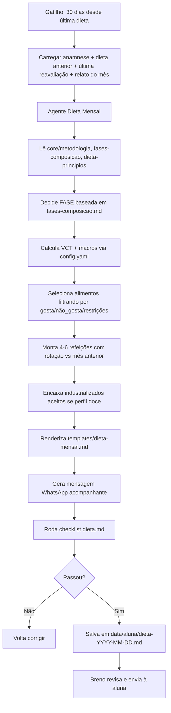

# Workflow — Dieta Mensal

Fluxo end-to-end: da atualização mensal da dieta até a entrega para a aluna.



## Gatilhos que disparam o workflow

1. **Tempo**: 30 dias desde a última dieta (`config.yaml.dieta.frequencia_atualizacao_dias`)
2. **Evento**: Nova reavaliação postural indicou mudança de fase (ex: secou → pode ganhar volume)
3. **Manual**: Breno pede ajuste antes do mês (ex: aluna reclamou de fome forte)

## Passos em detalhe

### 1. Coleta de contexto
- `data/<aluna>/anamnese.md` (ou Google Forms ainda)
- `data/<aluna>/dieta-<última>.md`
- `data/<aluna>/reavaliacao-<última>.md`
- `data/<aluna>/relato-mes.md` (se existir)

### 2. Decisão de fase
Passa pela árvore de `core/fases-composicao.md`:
- Tem gordura central visível? → déficit
- Está seca e quer ganhar? → superávit leve
- Está seca e só quer manter? → manutenção

### 3. Cálculo de macros
```
VCT_manutencao = peso * fator_atividade (25-32 kcal/kg)
VCT_alvo       = VCT_manutencao * (1 ± ajuste_da_fase)
Proteína g     = peso * [1.8, 2.2]
Gordura kcal   = VCT_alvo * [0.20, 0.30]
Carbo kcal     = VCT_alvo - prot - gord
```

### 4. Montagem das refeições
- Distribuir conforme rotina da aluna (acorda, treina, dorme)
- Priorizar proteína pós-treino
- Deixar carbo concentrado peri-treino em fase de ganho
- Incluir alternativas em **cada** refeição

### 5. Rotação mensal
- Trocar ≥1 proteína, ≥1 carbo, ≥1 receita vs. dieta anterior
- Preservar a espinha dorsal (macros, horários, volume)

### 6. Gate de qualidade
- `checklists/dieta.md` é checklist HARD

### 7. Persistência + comunicação
- Salva em `data/<aluna>/dieta-YYYY-MM-DD.md`
- Breno recebe preview + mensagem de WhatsApp
- Breno envia para a aluna

## Ligação com outros agentes

- **Recebe input de:** Agente de Reavaliação Postural (fase atualizada)
- **Futuro — envia para:** Agente de Treino (distribuição de carbo + proteína depende da carga)
- **Futuro — envia para:** Agente de Acompanhamento (monitora aderência nas próximas 4 semanas)
